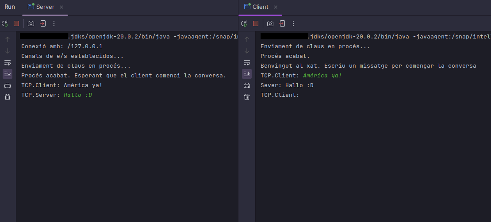

### Sistema de Chat Cliente-Servidor TCP con Encriptación asimétrica RSA

Este proyecto consiste en un sistema de chat seguro entre un cliente y un servidor TCP, donde los mensajes enviados están encriptados utilizando el algoritmo de encriptación asimétrica RSA.

### Encriptación Asimétrica y Algoritmo RSA

La encriptación asimétrica utiliza un par de claves distintas: una clave pública y una clave privada. El algoritmo RSA es uno de los algoritmos de encriptación asimétrica más utilizados, basado en la dificultad de factorizar grandes números primos.

- **Generación de Claves**: Se genera un par de claves, una pública y una privada.
- **Encriptación**: Los mensajes se encriptan con la clave pública del destinatario.
- **Desencriptación**: El destinatario utiliza su clave privada para descifrar el mensaje.

### Funcionamiento del Sistema de Chat

1. **Inicio de la Conversación**:
   - El cliente inicia la conexión con el servidor.
   - El servidor acepta la conexión entrante.

2. **Envío de Mensajes**:
   - El cliente envía mensajes al servidor.
   - Los mensajes se encriptan con la clave pública del servidor antes de enviarlos.

3. **Recepción de Mensajes**:
   - El servidor recibe los mensajes encriptados del cliente.
   - Los mensajes se desencriptan utilizando la clave privada del servidor y se imprimen en la consola.

4. **Respuesta del Servidor**:
   - El servidor puede enviar mensajes de vuelta al cliente, encriptados con la clave pública del cliente.

5. **Fin de la Conversación**:
   - El cliente puede terminar la conversación enviando un mensaje especial, como "bye".
   - Cuando el servidor recibe este mensaje, cierra la conexión y finaliza el chat.
  
### Ejecución del Proyecto

1. **Configuración del Entorno**:
   - Asegúrate de tener instalado JDK en tu sistema y configurado tu entorno de desarrollo.

2. **Ejecución del Servidor**:
   - Inicia el servidor en una terminal o en tu IDE.

3. **Ejecución del Cliente**:
   - Inicia el cliente en otra terminal o en otro proceso en tu IDE.
   - Comienza a enviar y recibir mensajes en el chat.

### Demo

